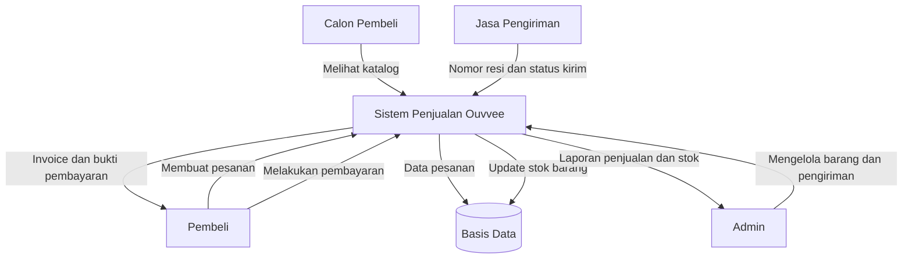

# Tahap 1: Analisa Kebutuhan User

## A. Kelompok User

Kelompok user pada Sistem Penjualan Barang Ouvvee adalah:

| Kelompok User | Keterangan |
|---|---|
| Admin | Mengelola data barang, melihat laporan penjualan, laporan stok, pembayaran, dan pengiriman. |
| Calon Pembeli | Melihat katalog barang sebelum melakukan pembelian. |
| Pembeli | Membeli barang, melakukan pembayaran, dan melihat status pengiriman. |

## B. Dokumen Yang Dihasilkan

Dokumen yang dihasilkan oleh sistem:

| Dokumen | Keterangan |
|---|---|
| Invoice | Bukti rincian transaksi pembelian barang. |
| Bukti Pembayaran | Bukti bahwa pembeli telah melakukan pembayaran. |
| Laporan Penjualan | Laporan transaksi penjualan barang. |
| Laporan Stok | Laporan jumlah stok barang yang tersedia. |
| Resi Pengiriman | Bukti pengiriman barang melalui jasa pengiriman. |

## C. Data Yang Dibutuhkan

Data yang dibutuhkan dalam sistem:

| Data | Keterangan |
|---|---|
| Data Admin | Data user yang mengelola sistem. |
| Data Pembeli | Data user yang melakukan pembelian. |
| Data Penjual | Data toko Ouvvee sebagai satu-satunya penjual. |
| Data Nomor Telepon Penjual | Menyimpan nomor telepon penjual yang dapat lebih dari satu. |
| Data Kategori | Data kategori barang. |
| Data Barang | Data produk yang dijual, seperti nama, harga, stok, deskripsi, dan kategori. |
| Data Pesanan | Data transaksi pembelian. |
| Data Detail Pesanan | Rincian barang yang dibeli dalam satu pesanan. |
| Data Pembayaran | Data metode pembayaran, tanggal pembayaran, status, dan total bayar. |
| Data Jasa Pengiriman | Data jasa pengiriman, yaitu JNE dan SiCepat. |
| Data Pengiriman | Data resi, ongkos kirim, dan status pengiriman. |

## D. DFD Sederhana

Alur sistem:

1. Calon pembeli melihat katalog barang.
2. Pembeli memilih barang dan membuat pesanan.
3. Sistem menyimpan data pesanan dan detail pesanan.
4. Stok barang berkurang sesuai jumlah barang yang dibeli.
5. Pembeli melakukan pembayaran dengan transfer bank, kartu kredit, atau CoD.
6. Sistem menyimpan data pembayaran dan menghasilkan invoice.
7. Admin memproses pengiriman menggunakan JNE atau SiCepat.
8. Sistem menyimpan nomor resi dan status pengiriman.
9. Admin melihat laporan penjualan dan laporan stok.

