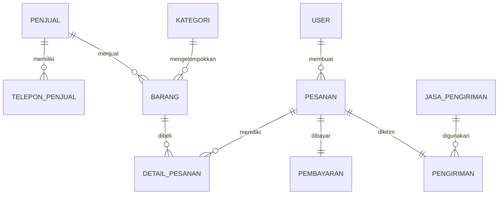

# Tahap 2: Perancangan Konseptual

## Langkah 1: Identifikasi Entitas

| Entitas | Alias | Keterangan |
|---|---|---|
| Penjual | Ouvvee | Pihak yang menjual barang. Pada sistem ini hanya ada satu penjual. |
| Telepon Penjual | Telp Penjual | Menyimpan nomor telepon penjual yang boleh lebih dari satu. |
| User | Pengguna | Admin dan pembeli yang menggunakan sistem. |
| Kategori | Kategori Barang | Kelompok jenis barang yang dijual. |
| Barang | Produk | Barang yang dijual oleh Ouvvee. |
| Pesanan | Transaksi | Data pembelian barang oleh pembeli. |
| Detail Pesanan | Detail Transaksi | Rincian barang dalam satu pesanan. |
| Pembayaran | Payment | Data pembayaran pesanan. |
| Jasa Pengiriman | Kurir | Pihak pengiriman barang, yaitu JNE dan SiCepat. |
| Pengiriman | Shipping | Data proses pengiriman barang. |

## Langkah 2: Identifikasi Atribut Setiap Entitas

| Entitas | Atribut |
|---|---|
| Penjual | id_penjual, nama_penjual, alamat, email |
| Telepon Penjual | id_telepon, id_penjual, nomor_telepon |
| User | id_user, nama, alamat, email, nomor_telepon, password, role |
| Kategori | id_kategori, nama_kategori |
| Barang | id_barang, id_penjual, id_kategori, nama_barang, harga, stok, deskripsi |
| Pesanan | id_pesanan, id_user, tanggal_pesanan, total_pesanan, status_pesanan |
| Detail Pesanan | id_detail, id_pesanan, id_barang, jumlah, harga_satuan, subtotal |
| Pembayaran | id_pembayaran, id_pesanan, metode_pembayaran, tanggal_bayar, status_pembayaran, total_bayar |
| Jasa Pengiriman | id_jasa, nama_jasa |
| Pengiriman | id_pengiriman, id_pesanan, id_jasa, nomor_resi, ongkos_kirim, status_kirim |

## Langkah 3: Identifikasi Atribut Kunci

| Entitas | Kunci Primer | Kunci Kandidat |
|---|---|---|
| Penjual | id_penjual | email |
| Telepon Penjual | id_telepon | nomor_telepon |
| User | id_user | email |
| Kategori | id_kategori | nama_kategori |
| Barang | id_barang | nama_barang |
| Pesanan | id_pesanan | - |
| Detail Pesanan | id_detail | id_pesanan, id_barang |
| Pembayaran | id_pembayaran | id_pesanan |
| Jasa Pengiriman | id_jasa | nama_jasa |
| Pengiriman | id_pengiriman | nomor_resi |

## Langkah 4: Identifikasi Superclass Dan Subclass

Superclass:

| Superclass | Subclass | Keterangan |
|---|---|---|
| User | Admin | User yang mengelola sistem. |
| User | Pembeli | User yang melakukan pembelian. |

Calon pembeli tidak dibuat sebagai subclass karena calon pembeli hanya melihat katalog dan belum memiliki data transaksi.

## Langkah 5: Model Konseptual

Relasi antar entitas:

| Relasi | Kardinalitas | Keterangan |
|---|---|---|
| Penjual - Telepon Penjual | 1 : N | Satu penjual dapat memiliki banyak nomor telepon. |
| Penjual - Barang | 1 : N | Satu penjual dapat menjual banyak barang. |
| Kategori - Barang | 1 : N | Satu kategori dapat memiliki banyak barang. |
| User - Pesanan | 1 : N | Satu pembeli dapat membuat banyak pesanan. |
| Pesanan - Detail Pesanan | 1 : N | Satu pesanan dapat berisi banyak barang. |
| Barang - Detail Pesanan | 1 : N | Satu barang dapat muncul di banyak detail pesanan. |
| Pesanan - Pembayaran | 1 : 1 | Satu pesanan memiliki satu pembayaran. |
| Jasa Pengiriman - Pengiriman | 1 : N | Satu jasa pengiriman dapat digunakan pada banyak pengiriman. |
| Pesanan - Pengiriman | 1 : 1 | Satu pesanan memiliki satu data pengiriman. |

